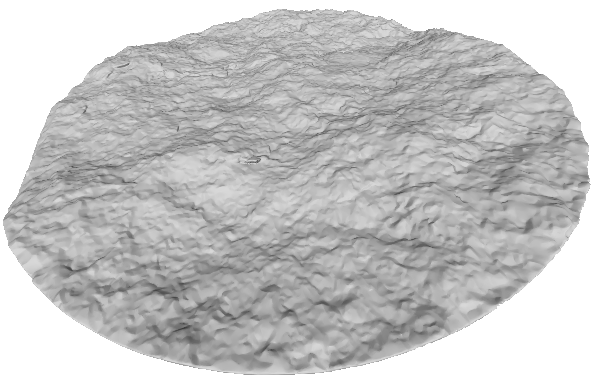

# HM coupled fracture response
Data for hydro-mechanically coupled processes in fractures subjected to fluid injection.

### Files
- aperture_fields: Aperture fields before and after testing as txt files.
- hm_data: Displacement sensor, fluid pressure, stress data etc.
- images: For aperture fields (with histograms), contact stresses (from FUJI film) and for all tests.
- load_data_processing: Read in of different measurement data, plotting and writing out to file.
- misc: Other properties.
- surface_scans: Surface scans pre- and post-testing as STL files. Already fitted. Can be opened with Meshlab. B side is bottom side.

### Publications
- von Planta, C., D. Vogler, P. Zulian, M.O. Saar, and R. Krause, Contact between rough rock surfaces using a dual mortar method, International Journal of Rock Mechanics and Mining Sciences (IJRMMS), 133, pp. 104414, 2020. [https://doi.org/10.1016/j.ijrmms.2020.104414](https://doi.org/10.1016/j.ijrmms.2020.104414)
- Vogler, D., R. R. Settgast, C. Annavarapu, C. Madonna, P. Bayer, and F. Amann, Experiments and Simulations of Fully Hydro-Mechanically coupled Response of Rough Fractures exposed to High Pressure Fluid Injection, Journal of Geophysical Research: Solid Earth, 123, pp. 1186-1200, 2018. [https://doi.org/10.1002/2017JB015057](https://doi.org/10.1002/2017JB015057)
- Kling, T., D. Vogler, L. Pastewka, F. Amann, and P. Blum, Numerical simulations and validation of contact mechanics in a granodiorite fracture, Rock Mechanics and Rock Engineering, 51/9, pp. 2805-2824, 2018. [https://doi.org/10.1007/s00603-018-1498-x](https://doi.org/10.1007/s00603-018-1498-x)  
- Vogler, D., R. Settgast, C. Annavarapu, P. Bayer, and F. Amann, Hydro-Mechanically Coupled Flow through Heterogeneous Fractures, Proc. of the 41st Workshop on Geothermal Reservoir Engineering Stanford University pp. SGP-TR-209 Stanford, CA, USA, February 13-15, 2017, Proceedings of the 41st Workshop on Geothermal Reservoir Engineering Stanford University, pp. SGP-TR-209, 2016.

### Example images

1) Surface topography vd2a  

2) Aperture field before testing  

3) Contact stresses
